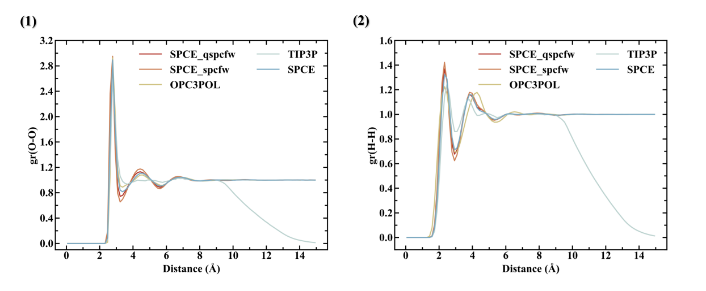

## Infrared spectrum of pure water calculated from dipole derivatives

(1) The influence of Hann window on Ir spectra; (2) Differences in Ir spectra obtained at different sampling times (PBE); (3) Differences in Ir spectra obtained at different sampling times (SPCE + qspcfw); (4) SPCE + qspcfw vs SPCE + spcfw (5) TIP3P (rigid) vs SPCE (rigid); (6) PBE vs SPECE + qspcfw, savgol_filter; (7) PBE vs SPECE + qspcfw, savgol_filter, gaussian_broadening

## Radial distribution function of water

(1) RDF (OW-OW); (2) RDF (HW-HW)
